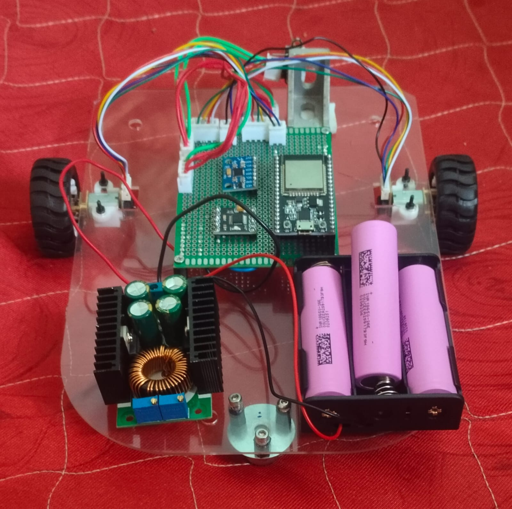

# Swarm Robotics for Rescue Missions

A multi-robot swarm system designed for search and rescue operations,
built around differential drive robots using ESP32 microcontrollers.

## Project Status
🔧 Hardware complete — navigation algorithms in development

## My Contributions
- Reviewed component layouts in Fusion 360
- Designed fabrication-ready chassis in AutoCAD for laser cutting
- Performed laser cutting on acrylic sheets for robot frame
- Assembled and soldered ESP32, N20 motors, boost converter,
  and sensors onto perfboard

## Hardware Components
- Microcontroller: ESP32
- Motors: N20 DC motors (differential drive)
- Power: 18650 Li-ion battery pack with boost converter
- Chassis: Laser-cut transparent acrylic
- Assembly: Perfboard with soldered components

## Tools & Technologies
- Fusion 360 — 3D component layout and design
- AutoCAD — fabrication drawing for laser cutting
- Laser Cutting — acrylic chassis fabrication
- Soldering — full electronics assembly

## Roadmap
- [ ] Implement ESP32 mesh communication
- [ ] Develop coordinated navigation algorithms
- [ ] Test multi-agent rescue simulation
